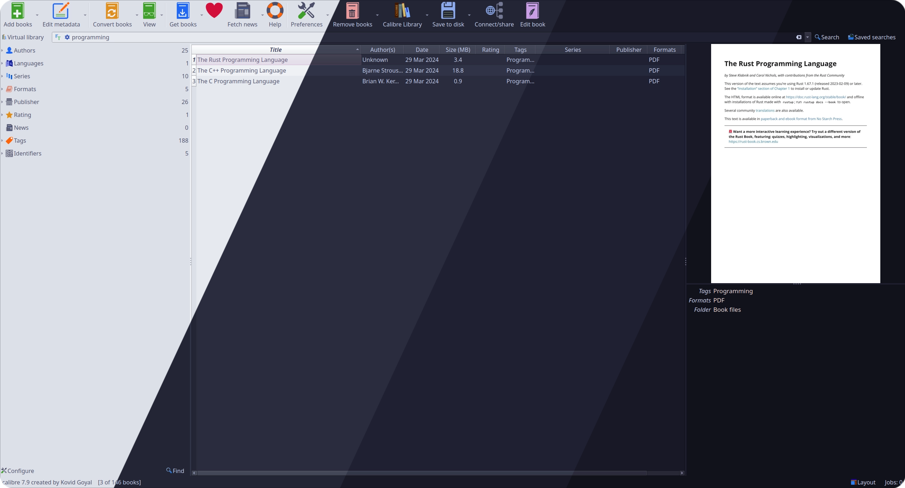
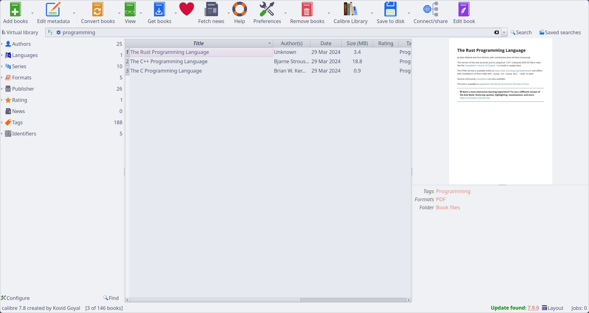
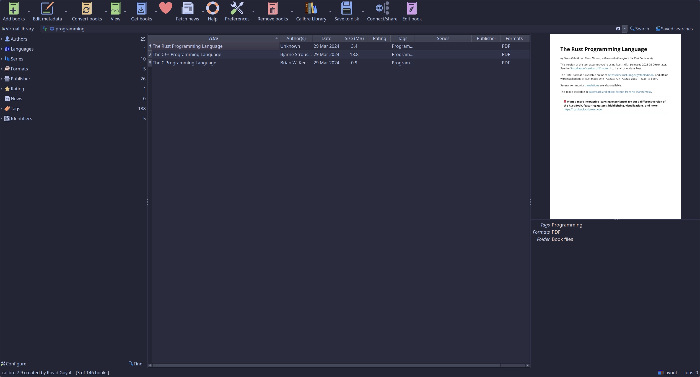
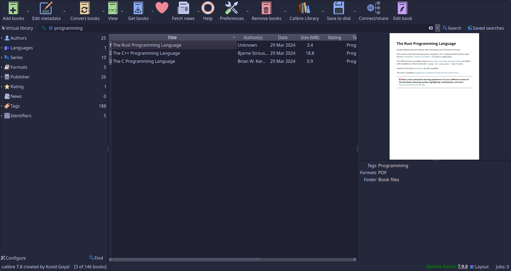
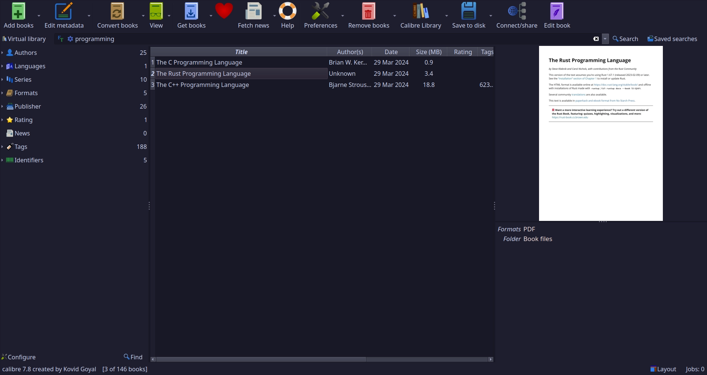

<h3 align="center">
	 
	
	Catppuccin for <a href="https://github.com/kovidgoyal/calibre">Calibre</a>
	
</h3>

	
	
	

	

## Previews

🌻 Latte

🪴 Frappé

🌺 Macchiato

🌿 Mocha

## Usage

1. Clone this repository locally
2. Open Calibre's preferences
3. Navigate to `interface -> look & feel`
4. Select `adjust colors` (top right)
5. Select `import` (bottom)
6. Select the flavour you want and apply!

Note: The latte theme is included in all themes as the light mode variant, select light or dark from the top right dropdown.

## 💝 Thanks to

- [42willow](https://github.com/42willow)

&nbsp;

	

	Copyright &copy; 2021-present <a href="https://github.com/catppuccin" target="_blank">Catppuccin Org</a>

	

